```{r setup, include=FALSE}
knitr::opts_chunk$set(echo = TRUE)
```


## Problem Context

When performing technical wine evaluations the taster aims to roughly quantify different aspects of a wine such as a wine's body, sweetness, acidity, and bitterness. While roughly quantifying these different characteristics is not extremely difficult after some training and calibration it is unclear if there is a clear correlation between these characteristics and a wine's quality.

## Inference Task

This project will attempt to understand which wine characteristics have the strongest effect on wine quality. Our predictor variables will be a wine's body, acidity, and price, and our response variable will be wine quality. To understand which characteristics have the strongest effect on quality, we will perform L1 regularized linear regression, forward variable selection, and MCMC to estimate which predictors better correspond to wine quality in linear models. We hypothesize that L1 regularized linear regression will include all three predictors, with small positive slopes on price and body and a small negative slope on acidity, forward variable selection will select price, followed by body and acidity, and that 95% Bayesian credible intervals will all include 0 as a possible slope. We expect the Bayesian method to provide a more comprehensive view of the slope values and the linear models to all perform roughly the same with respect to mean squared error in prediction quality.


## Modeling Challenge

The modeling challenge lies in determining a quantitative way of evaluating wine quality. Given the diverse attributes of different wines it may be difficult to determine rules of thumb, but it would not be completely surprising to associate high acidity, often caused by premature grape harvest, with poor quality or fuller bodies to be associated with better quality wines. Being able to differentiate wine quality from price would be beneficial for shoppers looking to enjoy their wine without unnecessary financial strain. This is why we will compare three different and interpretable methods for judging wine quality from body, acidity and price, seeing if there are useful rules of thumb when buying wine.

## Literature Review

Most of the existing analysis on Kaggle with the Spanish wine quality data that we are using for our analysis is concerned with predicting price from the other variables. The closest analysis to the one we will be performing uses categorical regression trees with boosting and Shapley Additive Explanation values to estimate the importance of different predictors. The source code for this analysis can be found [here](https://www.kaggle.com/code/dima806/spanish-wine-quality-explain). Our analysis of wine quality predictors is simpler than one with regression trees and introduces the Bayesian approach to the analysis.

## Lasso Model

We preprocess our data by standardizing all of our predictors, and centering the ratings. For our Lasso model, we choose the strongest regularization strength within 1 standard error of the minimum cross-validation mean squared error. This model assigns zero slope to acidity and body, and a small positive slope to price. The cross-validation mean squared error is 0.011.

## Forward Variable Selection

Using the same design matrix as we did for our Lasso model we now perform forward variable selection. Our forward variable selection algorithm chooses price, followed by body then acidity. This is a similar to result to what we found with our Lasso Model, and it explicitly ranks body ahead of acidity in terms of usefulness for prediction.

## Bayesian Model

We will construct a Bayesian Linear model where our predictors are body, acidity and price, and our response variable is rating. $\beta_1$ is the slope corresponding to the wine's body, $\beta_2$ corresponds to the wine's acidity and $\beta_3$ corresponds to the wine's price. Our model is specified below. \begin{align*} \beta_1 \sim \mathcal{N}(0,1) \\
\beta_2 \sim \mathcal{N}(0,1) \\ \beta_3 \sim \mathcal{N}(0,1) \\ \textrm{intercept} \sim \mathcal{N}(0,0.3)\\ \sigma^2 \sim \textrm{Exp}(2) \\ y_i|X \sim \mathcal{N}(\beta X_i + \textrm{intercept}, \sigma^2)
\end{align*}

The prior for the slope parameters is standard normal, since we have standardized our data we will want to use the same prior for all three predictor slopes in order to avoid any bias. We have a prior for an intercept that we will center at 0 since we don't want to bias the posterior intercept away from zero. Since the centered ratings range from -0.06 to 0.6 we don't want a massive standard deviation for our likelihood which is why we use the relatively high rate parameter on the prior.

We perform a prior predictive check to confirm that our prior choices are reasonable. Plots of potential outputs for our three slopes along with our potential intercept are shown below. \newline
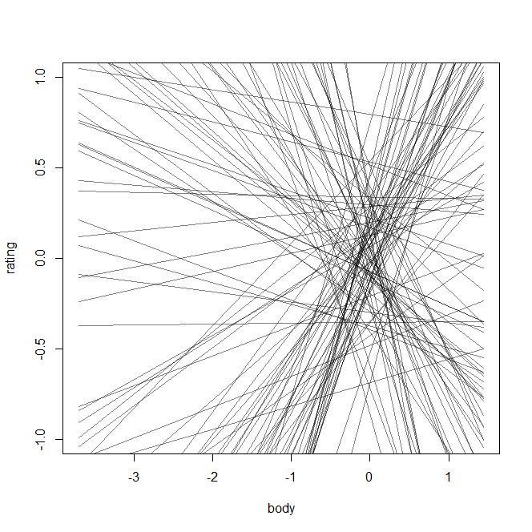{width=30%} 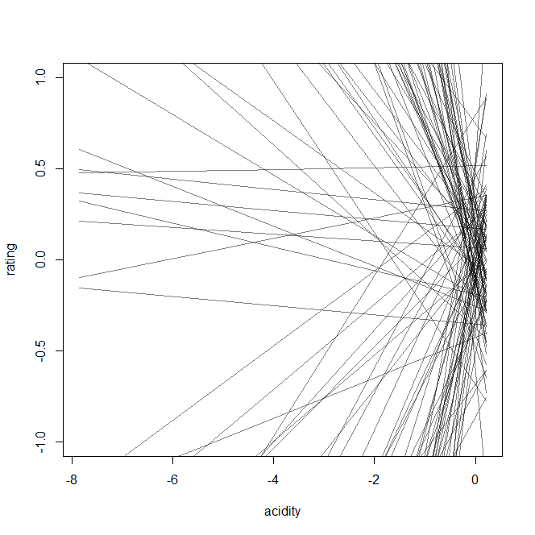{width=30%} 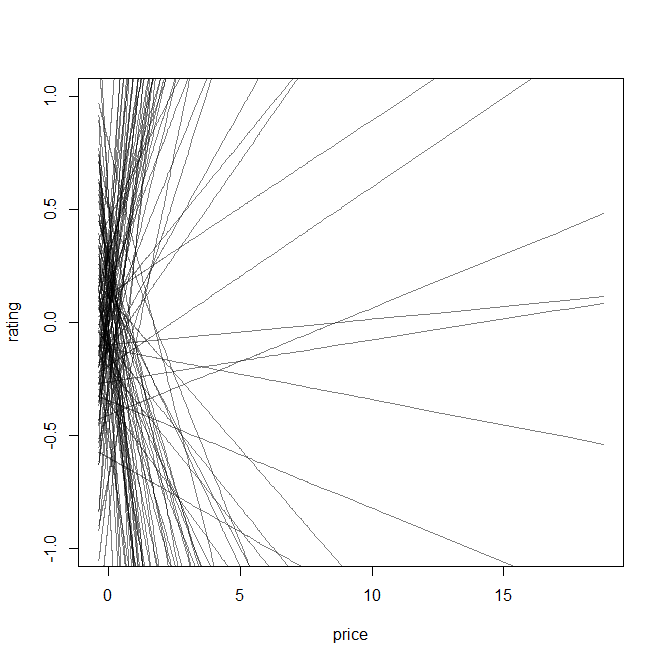{width=30%}

It looks like our prior is producing reasonable intercept values, but the slopes are far too extreme so we need to significantly reduce the standard deviation of our slope priors. We will try 0.1 as our standard deviation instead of 1. The updated prior predictive plots are shown below. \newline

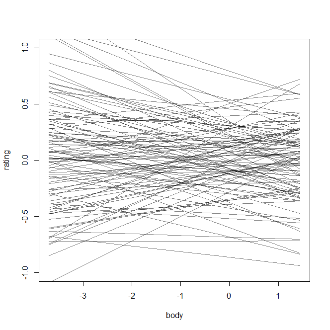{width=30%} 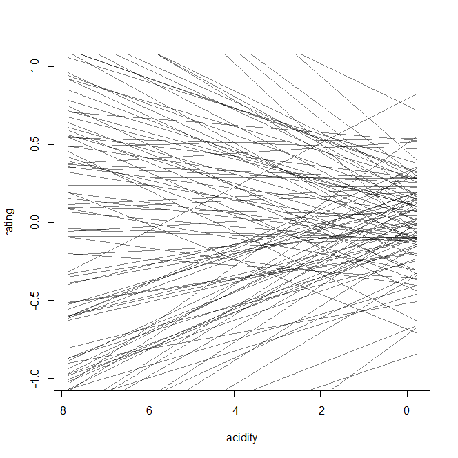{width=30%} 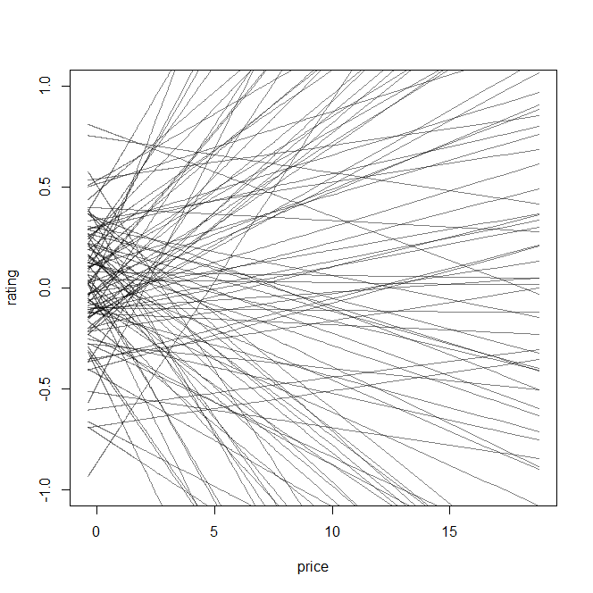{width=30%}

These prior predictive plots seem much more reasonable while maintaining sufficient flexibility across possible outcomes. Our updated model is then \begin{align*} \beta_1 \sim \mathcal{N}(0,0.1) \\ \beta_2 \sim \mathcal{N}(0,0.1) \\ \beta_3 \sim \mathcal{N}(0,0.1) \\ \textrm{intercept} \sim \mathcal{N}(0,0.3)\\ \sigma^2 \sim \textrm{Exp}(2) \\ y_i|X \sim \mathcal{N}(\beta X_i + \textrm{intercept}, \sigma^2)
\end{align*}

We now estimate our posterior distributions for our body, acidity, and price slopes by running Markov chain Monte Carlo (MCMC) using STAN. We use 2 chains for 10000 iterations and examine the trace and rank plots to ensure the chains mix well. The trace and rank plots for the body, acidity, and price slopes are shown below. \newline 
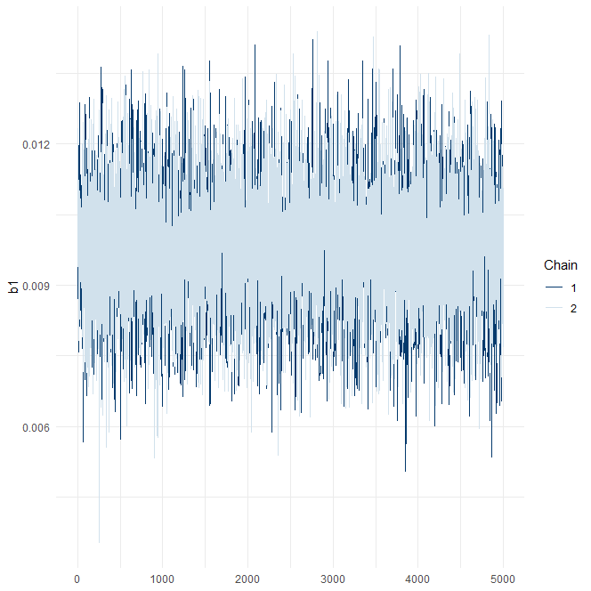{width=30%} 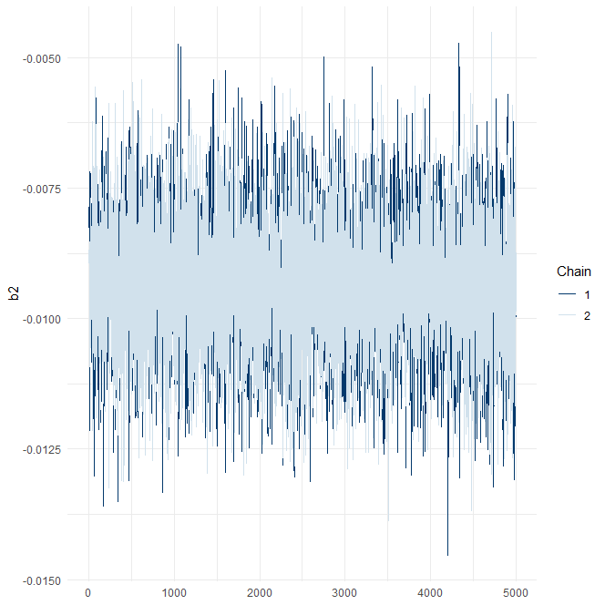{width=30%} 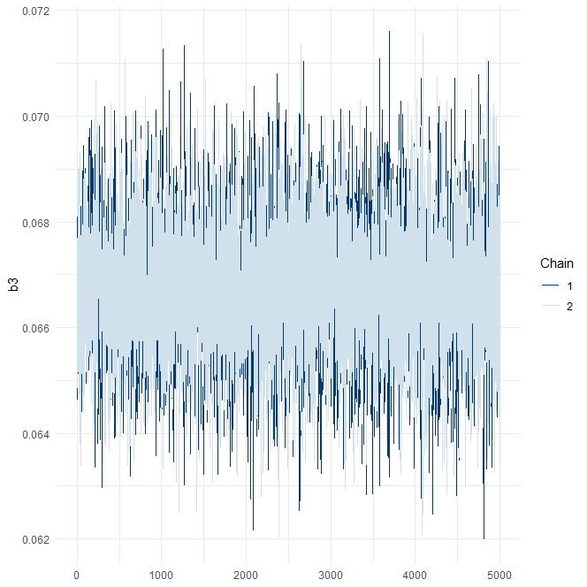{width=30%}\newline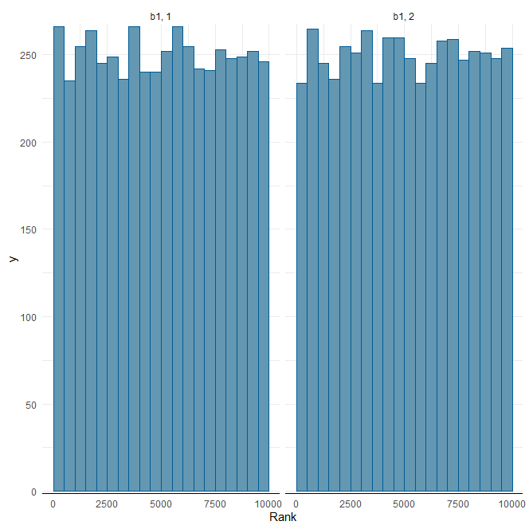{width=30%} 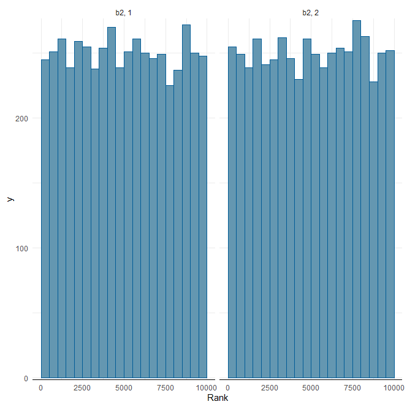{width=30%} 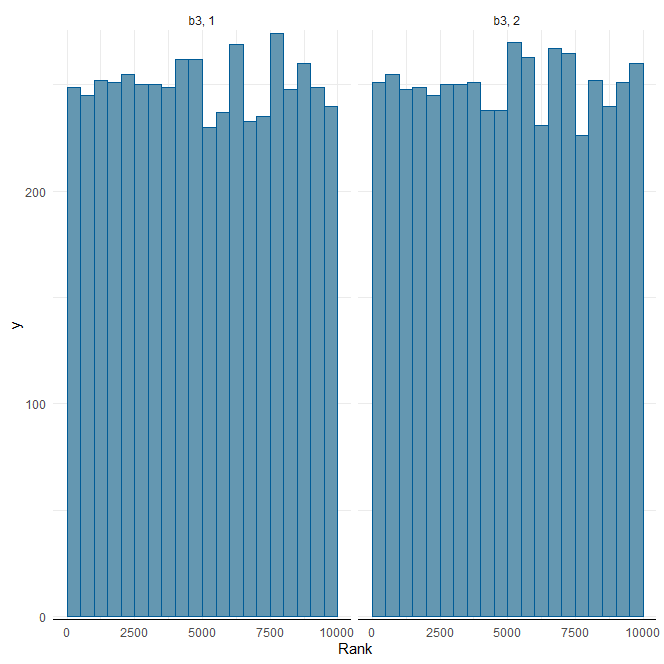{width=30%} \newline The trace plots for all three predictors show that the chains are mixing well and all of the rank plots are well balanced so it appears that slow mixing is not a problem for our MCMC algorithm.

We now perform our posterior predictive check. To do this we use a validation set that is roughly 10% of our data and generate predictions for this validation set in our MCMC algorithm. We find that the actual coverage of our 95% credible interval for the validation set of 632 observations is 100%, so our credible interval is over-conservative. A plot of the first 25 observations and their corresponding intervals is shown below. \newline 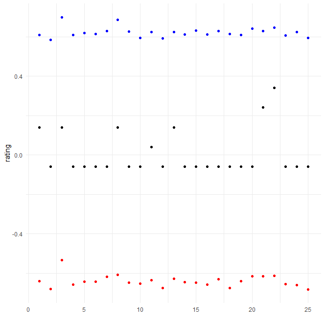{width=30%}

## Discussion


## Appendix


